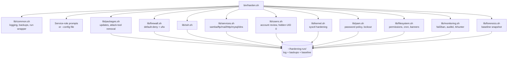

# CyberPatriot Linux Hardening Toolkit

A modular Bash toolkit for hardening Debian/Ubuntu-family systems under
competition time pressure. Built and refined across multiple seasons of
the [CyberPatriot National Youth Cyber Defense Competition](https://www.uscyberpatriot.org/),
most recently placing Platinum tier in the Linux division at the 2025
semifinal round.

This is not a general-purpose compliance framework. It is a checklist
automator for a six-hour timed exercise: it does the scriptable majority
of a Linux hardening pass correctly, quickly, and idempotently, logs
everything it touched, and leaves the judgment calls to the person
running it.

## Contents

- [Why this exists](#why-this-exists)
- [Architecture](#architecture)
- [Quick start](#quick-start)
- [What it actually does](#what-it-actually-does)
- [Competition safety notes](#competition-safety-notes)
- [Configuration](#configuration)
- [Repository layout](#repository-layout)
- [Testing](#testing)
- [Security controls and references](#security-controls-and-references)
- [What this project deliberately does not do](#what-this-project-deliberately-does-not-do)
- [License](#license)

## Why this exists

CyberPatriot's Linux rounds score a live image against a rubric that
rewards a fairly predictable set of hardening steps -- account hygiene,
password policy, firewall configuration, service exposure, file
permissions, patch level -- under a hard time limit, usually with no
prior notice of exactly which vulnerabilities were planted. Doing that
checklist by hand, correctly, under a countdown, is where teams lose easy
points to typos and forgotten steps, not to unknown material.

This toolkit started as a single monolithic script written under exactly
that pressure. This repository is a rewrite of that script: same
checklist coverage, restructured into small, single-purpose modules that
are easier to read, test, and reason about independently, with every
non-obvious decision tied back to a specific CIS Benchmark section or
NIST SP 800-53 control (see [Security controls and references](#security-controls-and-references)).

## Architecture



Every module is sourced by `bin/harden.sh`, which owns argument parsing,
the service-role questionnaire, and execution order. Modules do not call
each other directly, and every state-changing command in every module
goes through the `run()` wrapper in `lib/common.sh`, which gives the
whole project one place to implement dry-run support, consistent logging,
and non-fatal error handling.

## Quick start

```bash
git clone <this-repo>
cd cyberpatriot-linux-hardening
sudo ./bin/harden.sh
```

You will be asked a short series of yes/no questions about the machine's
role (does it need Samba, FTP, SSH, a web server, and so on), then it
runs unattended through the modules listed above. A log, a full set of
timestamped config backups, and a system baseline snapshot are written to
`~/hardening-run/`.

**In an actual round**, skip the per-package confirmation prompts and
answer the role questions from a prepared answer file instead of typing
them live:

```bash
cp examples/config.env.example my-machine.env
# edit my-machine.env for this box's actual role
sudo ./bin/harden.sh --config my-machine.env --auto-approve
```

Want to see exactly what it would do before it touches anything?

```bash
sudo ./bin/harden.sh --dry-run --config my-machine.env
```

## What it actually does

| Module | Does |
|---|---|
| `lib/packages.sh` | Full system update; removes password crackers and exploitation tools automatically; reviews dual-use tools (nmap, Wireshark, netcat) and legacy services (VNC, NFS, telnet) before removing them |
| `lib/firewall.sh` | Default-deny inbound / default-allow outbound via `ufw`, plus an explicit block on a known common backdoor port |
| `lib/ssh.sh` | Modern ciphers/KEX/MACs, no root login, connection and session limits -- or removes SSH entirely if the role doesn't need it |
| `lib/services.sh` | Samba, FTP, mail, printing, MySQL, HTTP, DNS: each is installed and minimally hardened if the role needs it, or purged and firewalled off if not |
| `lib/users.sh` | Interactive review of existing accounts (admin rights, deletion, password reset), detection of hidden UID-0 accounts and empty passwords |
| `lib/kernel.sh` | Network-stack and kernel self-protection sysctl settings (source routing, ICMP redirects, ASLR, ptrace scope, dmesg/kptr restriction) |
| `lib/pam.sh` | Password complexity and history via `pam_pwquality`/`pam_pwhistory`, account lockout via `pam_faillock`, password aging in `login.defs` |
| `lib/filesystem.sh` | Core file permissions, cron/at restriction, a minimal `rc.local`, legal login banners, read-only SUID/world-writable/unowned-file scan |
| `lib/monitoring.sh` | `fail2ban` and `auditd` by default; ClamAV and a full rkhunter/chkrootkit sweep are opt-in (see [Competition safety notes](#competition-safety-notes)) |
| `lib/forensics.sh` | Read-only snapshot of users, processes, listening ports, and installed packages for later comparison |

`tools/find-port-owner.sh` and `tools/list-nonstandard-users.sh` are
small standalone utilities for the same kind of triage work, usable
independently of the main script -- see their headers for usage.

## Competition safety notes

A hardening script that breaks the machine it's supposed to protect is
worse than useless in a timed round. A few defaults reflect that, and are
worth understanding before you run this unattended:

- **SSH password authentication defaults to on.** The stricter,
  keys-only CIS recommendation is one config value away
  (`SSH_PASSWORD_AUTH=no`), but the default here favors not locking a
  team out of its own machine when no one has provisioned keys yet.
- **Dual-use tools are reviewed, not auto-removed.** nmap, Wireshark,
  tcpdump, and netcat variants are common attacker tools, but they're
  also common admin tools, and some competition images specifically
  require one of them for the machine's stated role. They're purged
  after confirmation, not silently.
- **ClamAV and the rkhunter/chkrootkit sweep are opt-in**
  (`INSTALL_CLAMAV`, `RUN_BASELINE_SCAN`), because they are the two
  slowest things this script can do and neither changes system state on
  its own. Turn them on if your checklist calls for them or you have
  time to spare.
- **Nothing here verifies your scoring engine's connectivity.** The
  firewall module defaults to allow-all-outbound and only closes
  inbound ports for services the role doesn't need, but if your specific
  image reports to a scoring server or local agent over a nonstandard
  port, that is on you to check -- see `~/hardening-run/baseline/listening_ports.txt`
  from a prior run if you're unsure what's actually listening before you
  harden a box for the first time.
- **GRUB passwords are not automated**, for the same reason: a bad GRUB
  password can turn a hardening pass into an unbootable machine with no
  quick recovery path mid-round. See `docs/security-controls.md` for the
  manual procedure.
- **Every module is idempotent.** Re-running the script against an
  already-hardened machine (for example, after a partial run was
  interrupted) will not duplicate config blocks or error out.

## Configuration

`bin/harden.sh` will interactively ask about the machine's service role
if you don't answer up front. To skip the prompts, copy
`examples/config.env.example`, fill in the actual role, and pass it with
`--config`. Any variable you leave out of the file falls back to an
interactive prompt, so a partially-filled config file is fine.

```bash
sudo ./bin/harden.sh --config my-machine.env
```

Flags:

| Flag | Effect |
|---|---|
| `--config FILE` | Load role/policy answers from an env file |
| `--dry-run` | Log every action that would be taken; change nothing |
| `--auto-approve` | Skip the per-package purge confirmation prompts |

## Repository layout

```
.
├── bin/harden.sh                    orchestrator: parses args, asks role questions, runs modules in order
├── lib/
│   ├── common.sh                    logging, backups, idempotent file edits, the run() wrapper
│   ├── packages.sh                  updates, attack-tool removal
│   ├── ssh.sh                       SSH install/removal and hardening
│   ├── services.sh                  samba/ftp/telnet/mail/printing/mysql/http/dns
│   ├── firewall.sh                  ufw default-deny posture
│   ├── users.sh                     account review, hidden UID 0 / empty password detection
│   ├── kernel.sh                    sysctl hardening
│   ├── pam.sh                       password policy, account lockout
│   ├── filesystem.sh                permissions, cron, rc.local, banners, anomaly scan
│   ├── monitoring.sh                fail2ban, auditd, rkhunter, chkrootkit, ClamAV
│   └── forensics.sh                 read-only system baseline snapshot
├── tools/
│   ├── find-port-owner.sh           resolve a listening TCP port to a process path
│   └── list-nonstandard-users.sh    flag UID >= 1000 accounts not on an expected list
├── docs/
│   ├── security-controls.md         every hardening decision, mapped to its source standard
│   └── editor-cheatsheet.md         small editor commands worth remembering under pressure
├── examples/config.env.example      annotated template for non-interactive runs
└── .github/workflows/shellcheck.yml lint on every push/PR
```

## Testing

Every script is linted with [ShellCheck](https://www.shellcheck.net/) on
push via GitHub Actions (`.github/workflows/shellcheck.yml`). To check
locally before opening a PR:

```bash
shellcheck lib/*.sh bin/*.sh tools/*.sh
```

`bin/harden.sh --dry-run` is also, itself, a test: it exercises every
module's control flow and logging without touching the filesystem or
installing anything, and is the fastest way to sanity-check a change
against a disposable VM before running it for real. See
`CONTRIBUTING.md` for the full expectations on new modules (idempotency,
routing destructive actions through `run()`, and citing a source for any
new hardening step).

## Security controls and references

Every module's header comment and `docs/security-controls.md` cite the
specific standard section behind each decision. Primary sources used
throughout:

| Standard | Source |
|---|---|
| CIS Ubuntu Linux Benchmark | <https://www.cisecurity.org/benchmark/ubuntu_linux> |
| NIST SP 800-53 Rev. 5 | <https://csrc.nist.gov/pubs/sp/800/53/r5/upd1/final> |
| DISA STIG for Ubuntu | <https://public.cyber.mil/stigs/downloads/> |
| Mozilla OpenSSH modern configuration guidelines | <https://infosec.mozilla.org/guidelines/openssh> |
| CyberPatriot National Youth Cyber Defense Competition | <https://www.uscyberpatriot.org/> |

Detection tooling referenced (not vendored, installed via `apt`):
[fail2ban](https://github.com/fail2ban/fail2ban),
[Linux Audit / auditd](https://github.com/linux-audit/audit-userspace),
[rkhunter](https://rkhunter.sourceforge.net/),
[chkrootkit](https://www.chkrootkit.org/). [Lynis](https://github.com/CISOfy/lynis)
and [OpenSCAP](https://www.open-scap.org/) are recommended as a follow-up,
independent audit and are not run automatically by this project.

## What this project deliberately does not do

- Automate GRUB bootloader passwords (unbootable-machine risk; see above)
- Auto-remediate anything found by the SUID/world-writable/rootkit scans -- findings are logged for human review, never acted on automatically
- Download or run offensive enumeration tooling of any kind
- Touch packages it doesn't explicitly recognize -- an unfamiliar package (which may well be a scoring agent) is left alone rather than guessed at
- Cover GUI-only settings (screen-lock timeout, update-manager preferences, browser configuration) -- those still need to be checked by hand

See `docs/security-controls.md` for the full reasoning behind each of
these.

## License

MIT. See `LICENSE`.
